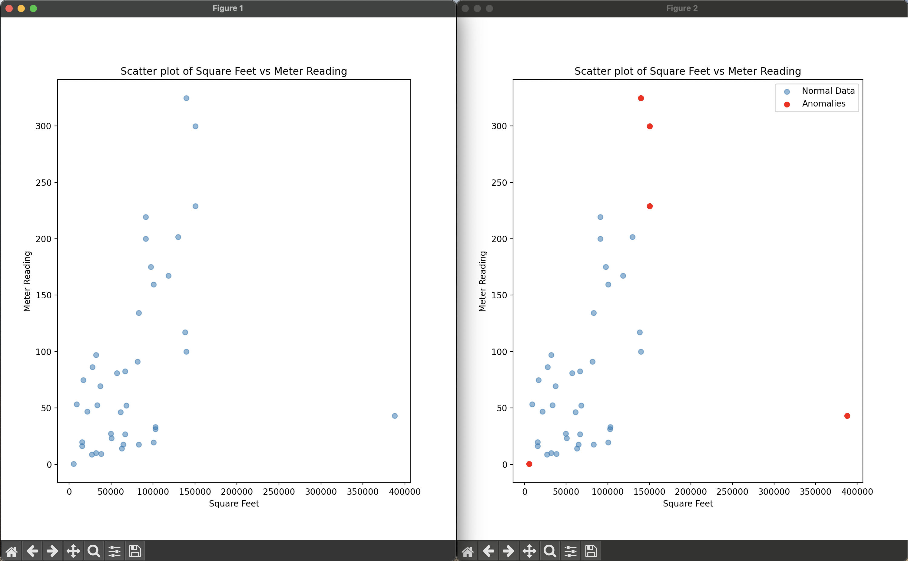

# Isolation Forest for Anomaly Detection in Energy Data

This project applies an **Isolation Forest** algorithm to detect anomalies in **building energy consumption data**. The dataset includes **square footage and meter readings** for various buildings, and anomalies are identified based on unusual energy usage patterns.

## Features
- Builds isolation trees recursively to isolate anomalous points.
- Computes anomaly scores based on average path lengths.
- Detects anomalies in **building meter readings**.
- Supports visualization of decision boundaries and anomalies.

## Dataset
The dataset consists of:
- `building_metadata.csv`: Contains metadata about buildings, including square footage.
- `train.csv`: Contains meter readings and building IDs.

After preprocessing, we use **square footage** and **meter readings** as the primary features for anomaly detection.

